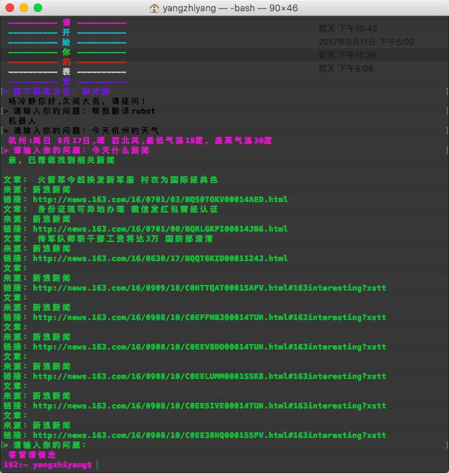

## 尬聊机器人
一个命令行聊天机器人，利用图灵机器人api实现一问一答的功能，可询问关于天气、新闻、菜谱等问题。
### 安装
`npm install smart-robot –g`
### 使用说明
安装后，在终端环境下直接输入`robot`运行，按照提示输入对应回答，一问一答模式，终端console.log输出随机颜色字体，若想退出，键入回车直接退出。
### 使用范例

### 相关参考资料：
[改变console.log输出颜色](https://stackoverflow.com/questions/9781218/how-to-change-node-jss-console-font-color)       

[readline的用法](https://nodejs.org/api/readline.html#readline_readline_clearscreendown_stream)     

[http.request的用法](https://nodejs.org/api/http.html#http_http_request_options_callback)    
